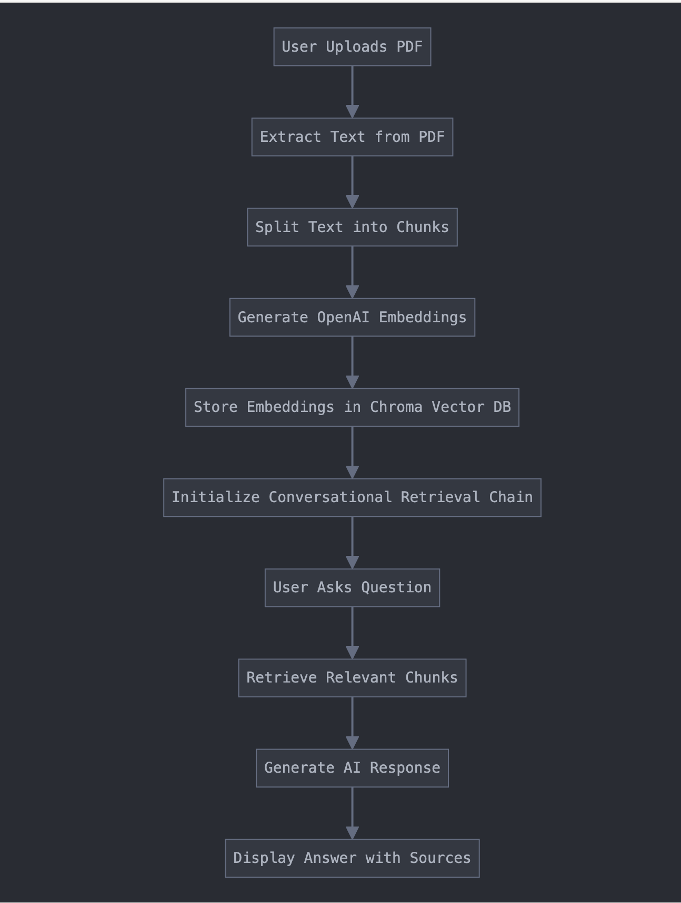

# PDF Q&A Assistant

The PDF Q&A Assistant is a Streamlit application that allows users to upload a PDF document and interact with its content through a conversational AI interface. By leveraging LangChain, Chroma, and OpenAI's GPT model, users can ask questions about the PDF and receive detailed responses based on the document's content.

---

## Features

- **PDF Text Extraction**: Extracts and cleans text from uploaded PDF files.
- **Document Processing**: Splits the PDF text into smaller, manageable chunks for embedding.
- **Vector Store Creation**: Generates embeddings using OpenAI and stores them in a persistent Chroma database.
- **Conversational AI**: Enables a natural question-and-answer interface powered by OpenAI's GPT-3.5-turbo.
- **Source Traceability**: Displays the sources used to generate each answer.

---

## Requirements

### Libraries

- Python 3.10+
- Streamlit
- PyPDF2
- LangChain
- LangChain Community VectorStores
- OpenAI
- ChromaDB

### Create a virtual environment and activate it:

```bash
python3 -m venv venv
source venv/bin/activate
```

### Installation

```bash
pip install streamlit PyPDF2 langchain langchain-community-vectorstores langchain-openai chromadb
```

---

## How It Works

1. **PDF Upload**: Users upload a PDF file through the sidebar.
2. **Text Processing**: The application extracts and cleans text from the uploaded PDF.
3. **Document Chunking**: The text is split into smaller chunks using LangChain's `RecursiveCharacterTextSplitter`.
4. **Vector Store Creation**: OpenAI embeddings are generated and stored in a Chroma vector store.
5. **Conversation Chain**: A conversational retrieval chain is initialized to handle user queries.
6. **Interactive Q&A**: Users ask questions, and the AI retrieves relevant chunks from the vector store to generate answers, complete with sources.

---

## Usage

1. **Run the Application**:

   ```bash
   streamlit run app.py
   ```

2. **Setup**:

   - Enter your OpenAI API key in the sidebar.
   - Upload a PDF file.

3. **Ask Questions**:
   - Type a question in the chat input box.
   - View the AI-generated answer and source documents.

---

## System Architecture



---

## Folder Structure

```plaintext
project-directory/
├── app.py                 # Main application script
├── chroma_db/             # Persistent storage for Chroma vector store
├── README.md              # Project documentation
└── requirements.txt       # List of dependencies
```

---

## Troubleshooting

### Common Issues

1. **No Text Extracted from PDF**:

   - Ensure the PDF contains selectable text. Scanned PDFs may require OCR preprocessing.

2. **API Key Error**:

   - Verify that the OpenAI API key is correct and active.

3. **Vector Store Not Created**:
   - Ensure the PDF contains enough text for processing.

---
